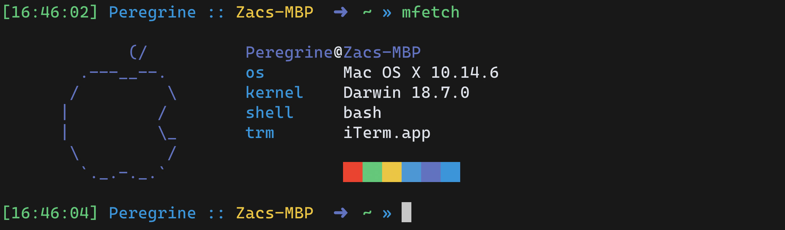

# mfetch for mac
  
Thanks to the great work of the original creator for making it so easy for a beginner to edit the script to work on Macs. Be sure to check the original repo out and give it a star.

mfetch is a tiny fetch script using less than 30 sloc! The original script returned `21` sloc. This one returns `29` sloc.  
```sh
$ grep -v '^$\|^#' mfetch | wc -l
29
```

The `wm` row has been replaced by one displaying the terminal type

## Install
```sh
git clone https://github.com/TechWiz-3/mfetch-macos.git
cd mfetch-macos
make
```

## Before (on linux)
<p></p>

## Before (on mac)
<p></p>

## After
<p></p>
<p></p>
<p></p>
<p></p>
<p></p>

---
### 🎉 Commit labels
If you're interested in the commit labels used in this repo, check out my [git emoji](https://github.com/TechWiz-3/git-commit-emojis) project
